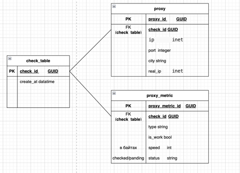

### API:

    POST: api/v1/proxy

request
```json
{
    "proxy_address": [
      "5.255.117.127:1080",
      "5.255.117.128:1080"
    ]

  }
```

response
```json
{
    "check_id": "82673fed-d401-4c1e-82e9-20f1f7aba941"
}
```

### API:

    GET: api/v1/proxy/{uuid}

response

```json
[
  {
    "check_id": "82673fed-d401-4c1e-82e9-20f1f7aba941",
    "ip": "5.255.117.127",
    "port": 1080,
    "city": "Poland, Warsaw",
    "real_ip": "5.255.117.127",
    "type": "SOCKS5",
    "is_work": true,
    "speed": 123124,
    "status": "checked"
  }
]
```

### API:

    GET: api/v1/proxy/history

response
```json
[
  {
    "check_id": "82673fed-d401-4c1e-82e9-20f1f7aba941",
    "create_at": "2025-01-15T12:30:00Z",
    "proxy_count": 2
  }
]
```


